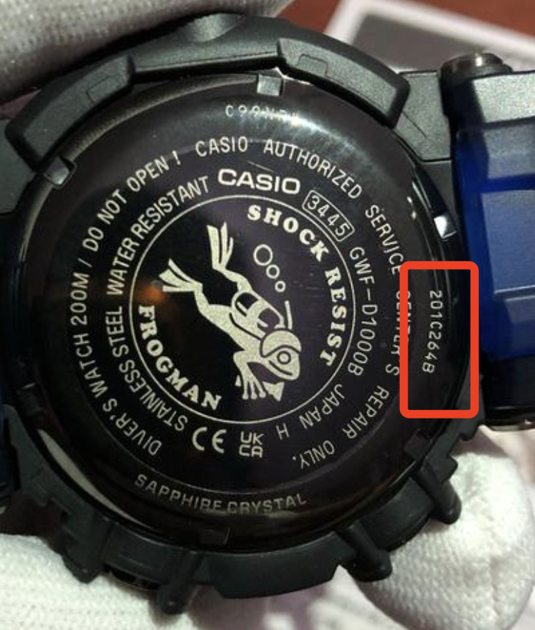
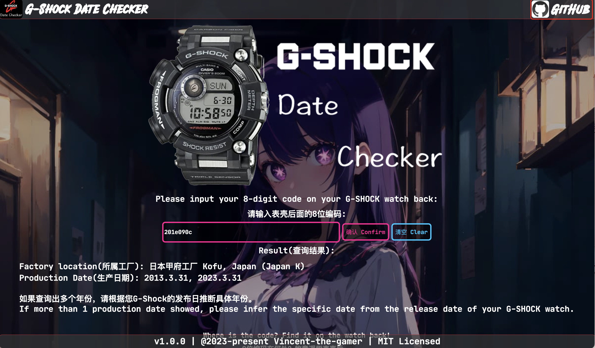

    

<h1 align="center">G-SHOCK Date Checker</h1>

Check your G-SHOCK production date

## G-SHOCK 8-digit Code
Casio G-SHOCK watches are using an 8-digit code to indicate which factory they are from, and the day they are built.

### Code Description:

The first 4 digits stand for the locations of factories.

**If there's any incorrect code explanation, please raise an issue.**

~~~json
{
    "201A": "日本山形工厂 Yamagata, Japan (Japan Y)",
    "201B": "日本甲府工厂 Kofu, Japan (Japan K)",
    "201C": "日本卡西欧工厂通用代码  Japan Universal Code",
    "201D": "日本山形卡西欧协力会社(合作伙伴）  Yamagata Casio Cooperation Association of Japan",
    "201E": "日本甲府工厂 Kofu, Japan (Japan K)",
    "201F": "日本山形工厂  Yamagata, Japan (Japan Y)",
    "202A": "泰国工厂  Thailand",
    "001A": "日本八王子工厂  Hachioji, Japan (Japan H)",
    "001C": "日本山形工厂  Yamagata, Japan (Japan Y)",
    "002A": "泰国工厂  Thailand",
    "212A": "泰国工厂  Thailand",
    "220A": "中国广州工厂  Guangzhou, China",
    "003A": "中国工厂  China",
    "004A": "卡西欧中国中山工厂  Casio China Zhongshan Factory",
    "104A": "中国工厂  China",
    "204A": "中国工厂  China",
    "222A": "泰国工厂  Thailand"
}
~~~

The last 4 digits stand for the date of built.

264B: 
* 264: the 264th day of this year
* B: 
    * A-J: 1234567890
    * B can be 2012, 2022 or 2032 in the future, you need to understand when your watch released, then judge the exact date it was built.

#### The last digit:
~~~json
{
    "A": 1,
    "B": 2,
    "C": 3,
    "D": 4,
    "E": 5,
    "F": 6,
    "G": 7,
    "H": 8,
    "I": 9,
    "J": 0
}
~~~

# Target
This repo will provide:
* Executable files of server.
* A **No backend** web page.

# Server

Call the only one API to get the G-Shock info.

## Start Server
* Start with default port

~~~shell
# unix-like OS
./g-shock-server

# windows
g-shock-server.exe
~~~

Server will run at port 8081.

* Start with custom port

~~~shell
# unix-like
./g-shock-server 2333

# windows
g-shock-server.exe 2333
~~~

Server will run at port 2333.

### Response of a successful request

**Example：**

Get `http://localhost:8081?code=201C264B`

~~~json
{
	"location": "日本卡西欧工厂通用代码  Japan Universal Code",
	"productionDate": "2012.9.20, 2022.9.21"
}
~~~

### Response of a failed request

**Example：**

Get `http://localhost:8081?code=asdasd`

~~~json
{
	"msg": "Your input is invalid! 你的输入不合法！"
}
~~~

# Web Page

Web Page is deployed at [https://vincent-the-gamer.github.io/g-shock-checker-page](https://vincent-the-gamer.github.io/g-shock-checker-page)

This page is written with `yew.rs`, a WASM(Web Assembly) frontend framework based on Rust. 

Thanks to the WASM, this page has **NOT** requested any API, but directly bundled the algorithm of the G-SHOCK code explaining logic, which is so cool😄. I'd like to build more **No backend web pages** in the future😊.

## Preview

# License

This project is MIT Licensed.

[License](./LICENSE)