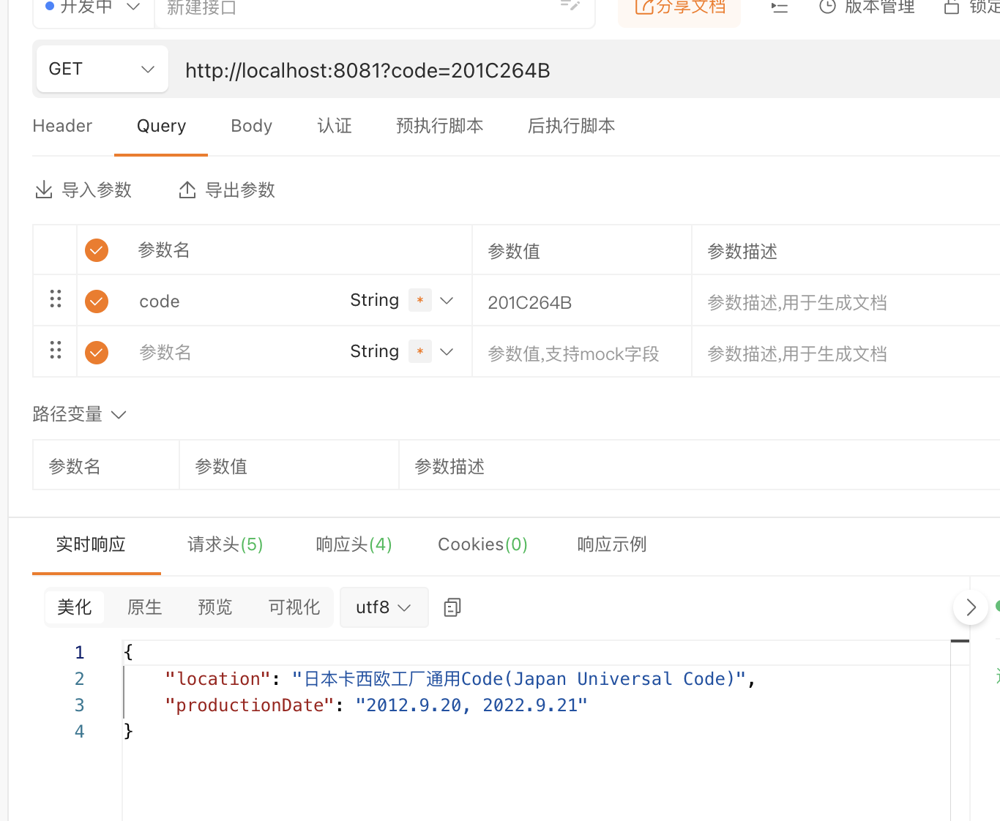

    

<h1 align="center">G-SHOCK Date Checker</h1>

Check your G-SHOCK production date

## G-SHOCK 8-digit Code
Casio G-SHOCK watches are using an 8-digit code to indicate which factory they are from, and the day they are built.

### Code Description:

The first 4 digits stand for the locations of factories.

~~~json
{
    "201A": "日本(Japan)",
    "201B": "日本(Japan)",
    "201C": "日本(Japan)",
    "201D": "日本(Japan)",
    "201F": "日本(Japan)",
    "202A": "泰国(Thailand)",
    "001A": "日本(Japan)",
    "001C": "日本(Japan)",
    "002A": "泰国(Thailand)",
    "212A": "泰国(Thailand)",
    "220A": "中国(China)",
    "003A": "中国(China)",
    "004A": "中国(China)",
    "104A": "中国(China)",
    "204A": "中国(China)"
}
~~~

The last 4 digits stand for the date of built.

264B: 
* 264: the 264th day of this year
* B: 
    * A-J: 1234567890
    * B can be 2012, 2022 or 2032 in the future, you need to understand when your watch released, then judge the exact date it was built.

#### The last digit:
~~~json
{
    "A": 1,
    "B": 2,
    "C": 3,
    "D": 4,
    "E": 5,
    "F": 6,
    "G": 7,
    "H": 8,
    "I": 9,
    "J": 0
}
~~~

### Usage
Web page will be add later!!!!

Currently provide execute binary file of http server, or you can use the crate directly by clone the repo.

#### Demo with ApiPost

To be continued...